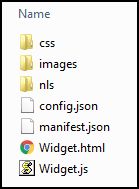
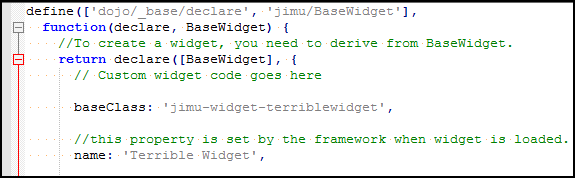

# Custom Widget #1 - The Terrible Widget
___

1)	Navigate to **\\client\stemapp\widgets\samplewidgets**

2)	Make a copy of **CustomWidgetTemplate** and call it **TerribleWidget**.  This template will contain the more commonly used files in the widget file structure.

    

3)	Make sure you a have a preferred text editor installed on your machine.  There are many to choose from.  If you are unsure which to use start out use [NotePad ++](https://notepad-plus-plus.org/) for Windows, or [Atom](https://atom.io/) for Mac.

4)	The folder structure should look like this.  Let’s open up the **Widget.js** file.

    
    
5)	Un-comment the following: 
    a.	**baseClass**:  change **jimu-widget-customwidget** to **jimu-widget-terriblewidget**. Note that JavaScript is case-sensitive.           Also make sure a comma exists at the end of this line.
    b.	**name:** un-comment this line and change to ‘Terrible Widget’
   
    
    
6)	Save the **Widget.js** file and close it.

7)	Open **Widget.html** in your text editor.  Copy the following HTML syntax (Change the name to your name or change the whole phrase if you so choose):

    ```
    <div>
        <div>Your name’s Terrible Widget</div>
    </div>
    ```

8)	Save the **Widget.html** and close it.

9)	Navigate to the **images** folder.  It will contain an image **icon.png** that is of a bookmark with width and height of 50x50.  Replace this icon with one of your own.  Have fun with it find something from free online sources like http://www.iconarchive.com/ , www.findicons.com, etc.  Use something from your phone if you want.  For best display results make the height and weight the same length preferably 50x50.  Example below:
