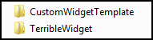

# Custom Widget #1 - The Terrible Widget
___

1)	Navigate to **\\client\stemapp\widgets\samplewidgets**

2)	Make a copy of **CustomWidgetTemplate** and call it **TerribleWidget**.  This template will contain the more commonly used files in the widget file structure.

    
